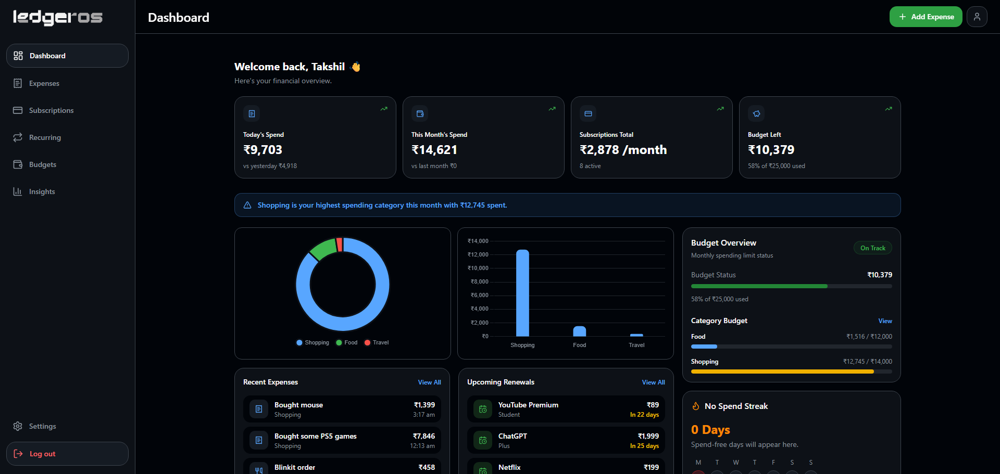
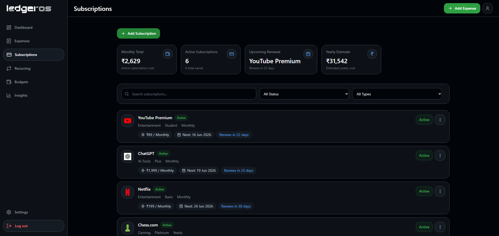
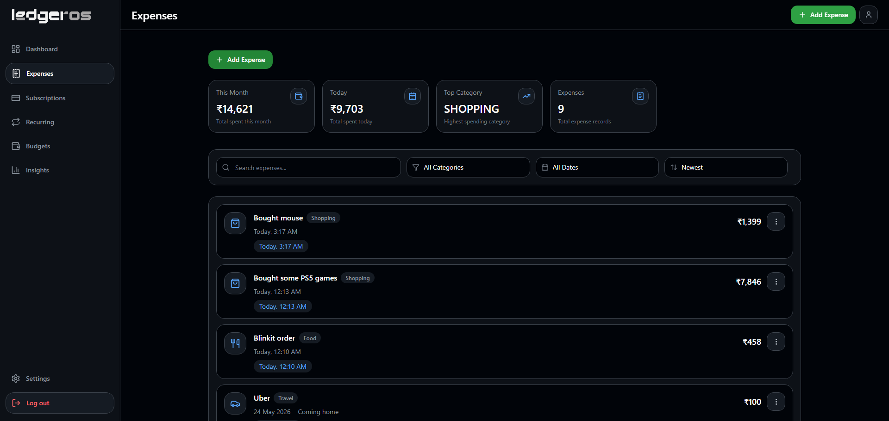
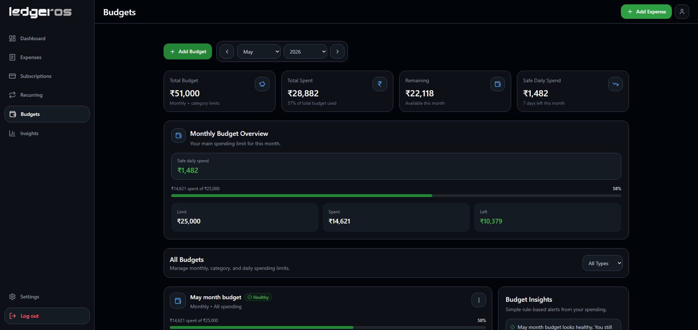
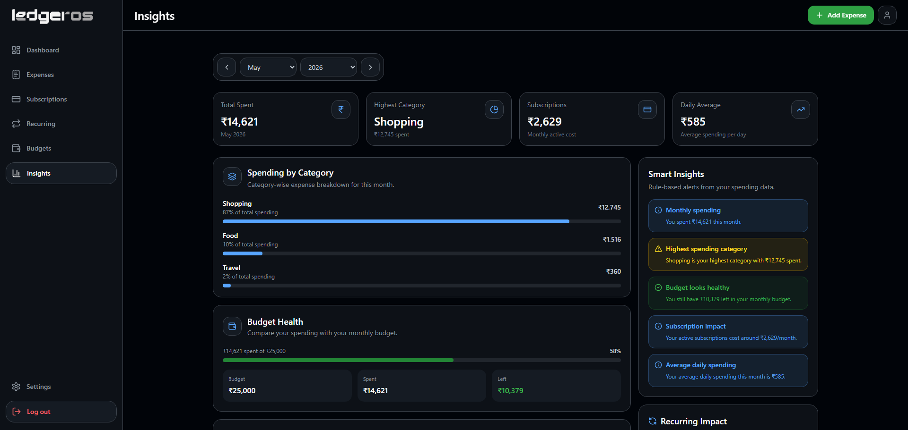

<p align="center">
  
</p>

<div align="center">

<h1 align="center">LedgerOS</h1>

A modern full-stack expense, subscription, budget, and recurring payment tracker built with a clean dashboard experience.

<br/>


</div>

---

## 🚀 About

**LedgerOS** is a production-style personal finance dashboard built to help users understand and manage their money in one place.

Users can track daily expenses, monitor subscriptions, manage recurring expenses, set budgets, view insights, and export their financial data.

This project was built as a full-stack portfolio project with authentication, database-backed features, analytics, caching, cron automation, responsive UI, and clean app architecture.

---

## ✨ Core Features

- Authentication with email/password and Google
- Financial dashboard with real analytics
- Expense tracking with filters, search, and sorting
- Subscription tracking with renewal management
- Recurring expense tracking
- Monthly, category, and daily limit budgets
- Insights page with spending analytics
- Chart.js visualizations
- CSV data export
- Account settings and profile management
- Redis caching for dashboard and insights
- Protected cron job for subscription renewal updates
- Responsive GitHub-inspired dark UI
- Skeleton loading states and smooth UX

---

## 📸 Screenshots

### Dashboard



---

### Subscriptions



---

### Expenses



---

### Budgets



---

### Insights



---

## 🛠️ Tech Stack

### Frontend

- Next.js App Router
- TypeScript
- Tailwind CSS
- Chart.js

### Backend

- Next.js Server Actions
- Next.js API Routes
- Auth.js / NextAuth

### Database

- PostgreSQL
- Prisma ORM

### State Management

- Zustand

### Caching

- Redis

---

## ⏰ Subscription Renewal Automation

LedgerOS includes a protected cron route that automatically updates overdue active subscription renewal dates.

It checks active subscriptions where:

```txt
isActive = true
nextRenewalDate < today
```

Then it moves the renewal date forward based on the billing cycle.

Example:

```txt
Monthly: 22 May 2026 → 22 June 2026
Yearly: 20 May 2026 → 20 May 2027
```

The cron route is protected using:

```env
CRON_SECRET=""
```

This is a V1 implementation. At larger scale, this can be moved to a queue or worker system with retries, batching, and monitoring.

---

## ⚙️ Local Setup

### 1. Clone the repository

```bash
git clone https://github.com/yourusername/ledgeros.git
cd ledgeros
```

---

### 2. Install dependencies

```bash
npm install
```

---

### 3. Setup environment variables

Create a `.env` file in the root directory:

```env
DATABASE_URL=""

AUTH_SECRET=""
NEXTAUTH_SECRET=""
NEXTAUTH_URL="http://localhost:3000"

GOOGLE_CLIENT_ID=""
GOOGLE_CLIENT_SECRET=""

REDIS_URL=""

CRON_SECRET=""
```

---

### 4. Run Prisma migration

```bash
npx prisma migrate dev
```

---

### 5. Generate Prisma client

```bash
npx prisma generate
```

---

### 6. Start development server

```bash
npm run dev
```

Open:

```txt
http://localhost:3000
```

---

## 📌 Project Status

> ✅ V1 Completed

LedgerOS V1 is complete with authentication, dashboard analytics, expenses, subscriptions, recurring expenses, budgets, insights, settings, CSV export, Redis caching, and subscription renewal automation.

---

<div align="center">

### Built with ❤️ using Next.js, Prisma, PostgreSQL, and Redis

</div>