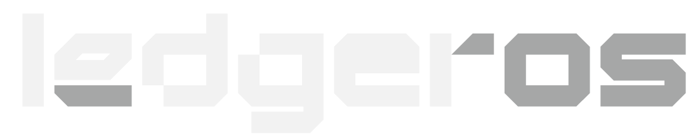

<p align="center">
  
</p>

<div align="center">

<h1 align="center">LedgerOS</h1>

Track expenses, manage subscriptions, monitor budgets, and build better spending habits with a clean modern dashboard experience.

<br/>


</div>

---

# 🚀 About Ledgeros

Ledgeros is a modern multi-user expense and subscription tracking platform focused on helping users:
- manage spending,
- track subscriptions,
- monitor budgets,
- and improve financial awareness.

The project is designed with:
- clean architecture,
- modern UI/UX,
- and production-style full-stack practices.

---

# ✨ Current Progress

## ✅ Completed
- Authentication system
- Dashboard UI
- Expense management system
- Expense filters & search
- Subscription management system
- Responsive dashboard layout

---

## 🚧 In Progress
- Budget system
- Expense charts
- Recurring expenses
- Weekly reports
- No Spend Day tracker
- Alerts & insights
- Redis caching
- Dashboard analytics
- Subscription templates

---

# 🛠️ Tech Stack

## Frontend
- Next.js (App Router)
- Tailwind CSS
- TypeScript

## Backend
- Next.js Server Actions
- API Routes

## Database
- PostgreSQL

## ORM
- Prisma ORM

## Authentication
- Auth.js / NextAuth

## State Management
- Zustand

## Charts
- Chart.js

## Caching
- Redis

---

# 📂 Planned Features

- Monthly budget tracking
- Category budgets
- Expense analytics
- Daily & weekly reports
- Subscription renewal tracking
- Recurring expense system
- Dashboard insights
- No Spend Day streak system
- Subscription templates

---

# 📸 Screenshots

> Screenshots coming soon...

---

# ⚡ Local Setup

## 1. Clone Repository

```bash
git clone https://github.com/yourusername/ledgeros.git
```

---

## 2. Install Dependencies

```bash
npm install
```

---

## 3. Setup Environment Variables

Create a `.env` file:

```env
DATABASE_URL=""

AUTH_SECRET=""
GOOGLE_CLIENT_ID=""
GOOGLE_CLIENT_SECRET=""
NEXTAUTH_SECRET=
NEXTAUTH_URL=
```

---

## 4. Run Prisma Migration

```bash
npx prisma migrate dev
```

---

## 5. Start Development Server

```bash
npm run dev
```

---

# 📌 Status

> 🚧 Active Development — V1 in Progress

---

<div align="center">

### Built with ❤️ using Next.js & Prisma

</div>